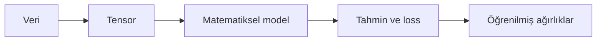
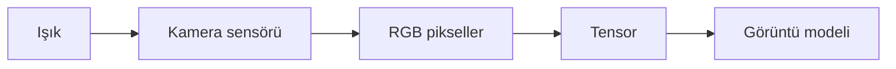
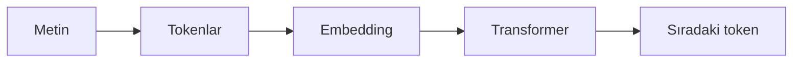
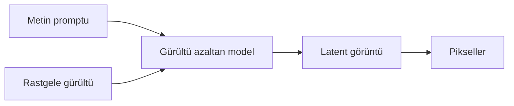
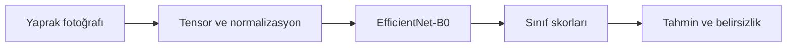

<p align="center">
  
</p>

<h1 align="center">Yapay Zekâyı Anlamak</h1>

<p align="center">
  <strong>Matematiksel temellerden dil, görüntü ve video modellerine</strong>
</p>

<p align="center">
  
  
  
  
</p>

<p align="center">
  <a href="#-5-dakikada-yapay-zekâ">Hızlı Başlangıç</a> •
  <a href="#-model-nasıl-öğrenir">Model Eğitimi</a> •
  <a href="#-bilgisayar-bir-görseli-nasıl-görür">Görüntü</a> •
  <a href="#-görsel-ve-video-nasıl-üretilir">Üretken AI</a> •
  <a href="#-güvenlik-ve-kara-kutu">Güvenlik</a> •
  <a href="./Yapay_Zeka_Nasil_Calisir_Arastirma_Notlari.md">Detaylı Notlar</a>
</p>

<p align="center">
  <a href="https://lhasanseker.github.io/REPO_ADIN/">
    
  </a>
</p>

> [!TIP]
> Bu README statik bir özet. `index.html` dosyası ise notlardaki her fikri (öğrenme döngüsü, piksel/convolution, token tahmini, difüzyon, güvenlik riskleri) canlı, sürüklenebilir ve tıklanabilir hale getiriyor. GitHub → **Settings → Pages → Branch: main /(root)** yolundan yayınlayıp yukarıdaki linki kendi adresinle (`KULLANICI_ADIN.github.io/REPO_ADIN`) güncelle.

---

> [!IMPORTANT]
> Bu çalışma, “Yapay zekâ gerçekten ne yapıyor?” sorusuna sıfırdan cevap verir. Kavramları yalnızca tanımlamakla kalmaz; **ağırlıkların nasıl öğrendiğini**, **bir görselin nasıl sayılara dönüştüğünü** ve **gürültüden nasıl görüntü üretildiğini** matematiksel örneklerle gösterir.

## ✨ Bu depoda ne var?

| 🧠 Öğrenme | 👁️ Görüntü | 💬 Dil |
|---|---|---|
| Nöron, ağırlık, bias, loss, gradyan inişi ve backpropagation | Piksel, convolution, CNN, EfficientNet ve Vision Transformer | Token, embedding, attention, Transformer ve sıradaki token tahmini |

| 🎨 Üretim | 🎬 Video | 🔐 Güvenlik |
|---|---|---|
| Difüzyon, latent space, metinden görsel üretimi | Uzamsal-zamansal attention ve kare tutarlılığı | Prompt injection, poisoning, veri sızıntısı ve güvenli sistem tasarımı |

### Araştırmanın ana fikri



> Yapay zekâ kodun canlanması değildir. Kod öğrenme düzenini kurar; **davranış**, veriler üzerinden ayarlanan milyonlarca veya milyarlarca sayısal ağırlıkta ortaya çıkar.

---

## ⚡ 5 dakikada yapay zekâ

Yapay zekânın çalışma döngüsü beş adımdır:

| Adım | Modelin yaptığı | İnsan dilindeki karşılığı |
|---:|---|---|
| `01` | Girdiyi sayılara dönüştürür | Fotoğrafı piksel, metni token olarak alır |
| `02` | Matematiksel fonksiyonlardan geçirir | Bir tahmin oluşturur |
| `03` | Tahmin ile doğru cevabı karşılaştırır | Ne kadar hata yaptığını ölçer |
| `04` | Türevleri hesaplar | Hangi ağırlığın hataya neden olduğunu bulur |
| `05` | Ağırlıkları günceller | Bir sonraki tahmini biraz iyileştirir |

```text
Veri → Tahmin → Hata → Türev → Güncelleme → Tekrar
```

### Klasik kod ile farkı

```python
# Klasik programlama: Kuralı insan yazıyor.
if calisma_saati >= 4:
    sonuc = "Geçer"
```

Makine öğrenmesinde `4 saat` kuralını söylemeyiz. Modele geçmiş örnekleri gösteririz:

```text
1 saat → Kaldı
2 saat → Kaldı
4 saat → Geçti
6 saat → Geçti
```

Model bu örneklerdeki sınırı, kendi ağırlıklarını değiştirerek yaklaşık olarak öğrenir.

---

## 📉 Model nasıl öğrenir?

En basit yapay nöron:

$$
z=wx+b
$$

Burada:

- $x$: modele verilen giriş
- $w$: girişin önemini belirleyen öğrenilebilir ağırlık
- $b$: karar sınırını kaydıran öğrenilebilir bias
- $z$: nöronun ham çıktısı

İkili sınıflandırmada sonuç sigmoid fonksiyonundan geçirilebilir:

$$
\sigma(z)=\frac{1}{1+e^{-z}}
$$

### Tek eğitim adımı

Bir öğrenci 2 saat çalışmış ve sınavı geçmiş olsun:

```text
x = 2      gerçek cevap y = 1
w = 0      b = 0
```

İlk tahmin:

$$
z=(0\times2)+0=0 \qquad \sigma(0)=0.5
$$

Model yüzde 50 tahmin üretir. Gerçek cevap `1` olduğu için hata vardır. Türevler:

$$
\frac{\partial L}{\partial w}=(p-y)x=(0.5-1)\times2=-1
$$

$$
\frac{\partial L}{\partial b}=p-y=-0.5
$$

Learning rate `0.1` ile güncelleme:

$$
w_{yeni}=0-0.1(-1)=0.1
$$

$$
b_{yeni}=0-0.1(-0.5)=0.05
$$

| Durum | $w$ | $b$ | Tahmin | Loss |
|---|---:|---:|---:|---:|
| Eğitimden önce | `0.00` | `0.00` | `0.500` | `0.693` |
| Bir güncelleme sonra | `0.10` | `0.05` | `0.562` | `0.576` |

Loss küçüldü. Model bunu binlerce örnekte tekrar ederek uygun ağırlıklara yaklaşır.

<details>
<summary><strong>🔥 Aynı işlemin PyTorch karşılığını aç</strong></summary>

```python
import torch
import torch.nn as nn
import torch.optim as optim

torch.manual_seed(42)

x_train = torch.tensor([
    [0.0], [1.0], [2.0], [3.0],
    [4.0], [5.0], [6.0], [7.0]
])

y_train = torch.tensor([
    [0.0], [0.0], [0.0], [0.0],
    [1.0], [1.0], [1.0], [1.0]
])

model = nn.Linear(1, 1)
loss_fn = nn.BCEWithLogitsLoss()
optimizer = optim.SGD(model.parameters(), lr=0.1)

for epoch in range(2000):
    logits = model(x_train)       # Tahmin
    loss = loss_fn(logits, y_train)  # Hata

    optimizer.zero_grad()
    loss.backward()               # Türevler
    optimizer.step()              # w ve b güncellemesi

model.eval()
with torch.no_grad():
    probability = torch.sigmoid(model(torch.tensor([[4.5]])))

print("Geçme olasılığı:", probability.item())
```

`loss.backward()` türevleri otomatik hesaplar. `optimizer.step()` ise ağırlıkları gradyanın ters yönünde günceller.

</details>

> [!TIP]
> PyTorch yapay zekânın kendisi değildir. Tensor, sinir ağı katmanları, otomatik türev ve GPU işlemlerini sağlayan geliştirme aracıdır.

---

## 👁️ Bilgisayar bir görseli nasıl görür?

Modelin biyolojik gözü yoktur. Kamera, gerçek dünyadaki ışığı piksel sayılarına dönüştürür.



Bir renkli piksel üç sayı içerir:

| Renk | RGB değeri | Modelin aldığı sayı |
|---|---|---|
| 🔴 Kırmızı | `[255, 0, 0]` | Üç kanallı vektör |
| 🟢 Yeşil | `[0, 255, 0]` | Üç kanallı vektör |
| 🔵 Mavi | `[0, 0, 255]` | Üç kanallı vektör |
| ⚪ Beyaz | `[255, 255, 255]` | Yüksek kanal değerleri |
| ⚫ Siyah | `[0, 0, 0]` | Düşük kanal değerleri |

224×224 renkli bir görüntü:

$$
3\times224\times224=150{,}528\ sayı
$$

olarak temsil edilir.

### 3×3 pikselde kenar bulma

Aşağıdaki küçük görüntü parçasının solu karanlık, sağı aydınlıktır:

$$
X=
\begin{bmatrix}
10&10&240\\
10&10&240\\
10&10&240
\end{bmatrix}
$$

Dikey kenar filtresi:

$$
K=
\begin{bmatrix}
-1&0&1\\
-1&0&1\\
-1&0&1
\end{bmatrix}
$$

Elemanlar çarpılıp toplandığında:

$$
(-10+240)+(-10+240)+(-10+240)=690
$$

`690` değerinin büyüklüğü güçlü bir dikey renk geçişini gösterir. Modelin “görmesi”, aslında bu tür sayısal ilişkileri hesaplamasıdır.

<details>
<summary><strong>🖼️ Convolution hesabının PyTorch kodunu aç</strong></summary>

```python
import torch
import torch.nn.functional as F

image = torch.tensor([[[[
    10.0, 10.0, 240.0,
], [
    10.0, 10.0, 240.0,
], [
    10.0, 10.0, 240.0,
]]]])

kernel = torch.tensor([[[[
    -1.0, 0.0, 1.0,
], [
    -1.0, 0.0, 1.0,
], [
    -1.0, 0.0, 1.0,
]]]])

feature_map = F.conv2d(image, kernel)
print(feature_map.item())  # 690.0
```

</details>

### CNN ne öğrenir?

```text
Pikseller
  ↓
Kenarlar ve renk geçişleri
  ↓
Dokular, lekeler ve nesne parçaları
  ↓
Sınıfa ilişkin karmaşık örüntüler
```

Vision Transformer ise görüntüyü patch adı verilen parçalara ayırır. 224×224 görüntü, 16×16 patch'lerle işlendiğinde `196` görsel token oluşur. Attention, uzak görüntü bölgelerinin ilişkisini hesaplar.

---

## 💬 Dil modeli nasıl konuşur?

Dil modeli metni doğrudan harfler olarak değil, token ve embedding'ler olarak işler:



Model şu cümlenin devamı için olasılık üretir:

```text
“Türkiye'nin başkenti ...”
```

```text
Ankara    %96
İstanbul   %2
İzmir      %1
Diğer      %1
```

Transformer'ın attention hesabı:

$$
Attention(Q,K,V)=softmax\left(\frac{QK^T}{\sqrt{d_k}}\right)V
$$

- **Query:** Hangi bilgiye ihtiyacım var?
- **Key:** Hangi bilgiyi temsil ediyorum?
- **Value:** Taşıdığım içerik nedir?

Model, seçtiği tokenı bağlama ekler ve bir sonraki token için işlemi yeniden yapar. Akıcı metin bu döngünün tekrarından oluşur.

> [!WARNING]
> Akıcı cevap, doğru cevap anlamına gelmez. Model eksik bilgiyi dilsel örüntülerle tamamlayarak ikna edici fakat yanlış bilgi üretebilir. Buna **halüsinasyon** denir.

---

## 🎨 Görsel ve video nasıl üretilir?

Modern görsel üreticilerde yaygın temel yaklaşımlardan biri difüzyondur.



### Difüzyonun temel fikri

Eğitim sırasında temiz görüntüye gürültü eklenir:

$$
x_t=\sqrt{\bar{\alpha}_t}x_0+\sqrt{1-\bar{\alpha}_t}\epsilon
$$

Model, eklenen gürültüyü tahmin etmeyi öğrenir:

$$
L=\mathbb{E}\left[\|\epsilon-\epsilon_\theta(x_t,t,c)\|^2\right]
$$

Üretim sırasında tamamen rastgele gürültüden başlanır ve model bunu adım adım metne uygun görüntüye dönüştürür.

| Metin modeli | Görsel modeli | Video modeli |
|---|---|---|
| Sıradaki tokenı tahmin eder | Gürültüyü görüntüye dönüştürür | Gürültüyü tutarlı karelere dönüştürür |
| Tokenlar üzerinde çalışır | Piksel veya latent üzerinde çalışır | Uzay-zaman tensoru üzerinde çalışır |
| Bağlam tutarlılığı gerekir | Şekil ve renk tutarlılığı gerekir | Kimlik, hareket ve zaman tutarlılığı gerekir |

Video üretimi daha zordur; çünkü karakterin yüzü, kıyafeti, ışık, nesneler ve kamera hareketi kareler boyunca korunmalıdır.

---

## ⬛ Güvenlik ve kara kutu

Derin modellerde karar, milyonlarca parametrenin ortak etkisiyle oluşur. Ağırlıkları görebiliriz fakat tek bir ağırlığı insan cümlesiyle açıklamak çoğunlukla mümkün değildir. Bu nedenle modellere **kara kutu** denir.

### Açıklanabilirlik araçları

| Yöntem | Ne gösterir? |
|---|---|
| Grad-CAM | CNN kararında etkili görünen görüntü bölgeleri |
| SHAP | Özelliklerin tahmine yaklaşık katkısı |
| LIME | Belirli bir tahminin yerel, yaklaşık açıklaması |
| Attention visualization | Token veya patch ilişkileri |

### Başlıca güvenlik riskleri

| Risk | Kısa açıklama | Savunma fikri |
|---|---|---|
| Prompt injection | Güvenilmeyen içeriğin modeli saptırması | Güven sınırları ve araç doğrulama |
| Data poisoning | Eğitim verisinin bozulması | Kaynak ve veri kalite kontrolü |
| Hassas veri sızıntısı | Gizli bilginin çıktıya taşınması | Veri minimizasyonu ve erişim kontrolü |
| Adversarial example | Küçük değişikliklerle yanlış tahmin | Sağlamlık testleri ve izleme |
| Excessive agency | Modele fazla işlem yetkisi verilmesi | En az yetki ve insan onayı |
| Insecure output handling | Model çıktısının doğrudan çalıştırılması | Şema kontrolü, sanitization ve sandbox |

> [!CAUTION]
> Güvenlik, “model yanlış yapmaz” varsayımıyla kurulmaz. Model yanlış davransa bile zarar veremeyeceği izinler ve doğrulamalar tasarlanır.

---

## 🍇 Gerçek proje bağlantısı: Üzüm yaprağı hastalık modeli

Bu araştırmanın görüntü bölümü, bir üzüm yaprağı hastalık sınıflandırma projesine doğrudan uygulanabilir:



Örnek çıktı:

| Sınıf | Model skoru |
|---|---:|
| Healthy | `%3` |
| Black Rot | `%93` |
| Esca | `%3` |
| Leaf Blight | `%1` |

Modelin yüksek skor üretmesi tek başına doğru biyolojik belirtiyi öğrendiğini kanıtlamaz. Arka plan, kamera veya filigran gibi sahte ilişkileri kullanıp kullanmadığı Grad-CAM ve gerçek saha testleriyle incelenmelidir.

---

## 🗺️ Öğrenme rotası

- [x] Yapay zekâ ve makine öğrenmesi farkı
- [x] Tensor ve sayısal veri temsili
- [x] Nöron, ağırlık ve bias
- [x] Loss, türev ve gradyan inişi
- [x] PyTorch eğitim döngüsü
- [x] CNN ve piksel analizi
- [x] Token, embedding ve Transformer
- [x] Difüzyon ve video üretimi
- [x] Kara kutu ve yapay zekâ güvenliği
- [ ] NumPy ile sıfırdan tek nöron yazmak
- [ ] PyTorch ile küçük bir görüntü sınıflandırıcı eğitmek
- [ ] Grad-CAM ile modelin baktığı bölgeleri incelemek

---

## 📚 Detaylı araştırma notu

Bu README konuyu hızlı ve görsel biçimde anlatır. Aşağıdaki dosyada tüm başlıklar daha ayrıntılıdır:

<p align="center">
  <a href="./Yapay_Zeka_Nasil_Calisir_Arastirma_Notlari.md">
    
  </a>
</p>

Detaylı dosyada ayrıca şunlar bulunur:

- Epoch, batch, optimizer ve overfitting
- Softmax'ın sayısal örneği
- EfficientNet transfer learning kodu
- Vision Transformer patch hesabı
- Çok modlu modeller
- Latent space ve VAE
- Video tensorları
- Yetkili güvenlik testi yöntemi
- Terimler sözlüğü ve kapsamlı kaynakça

---

## 🔗 Birincil kaynaklar

- [PyTorch — Learn the Basics](https://docs.pytorch.org/tutorials/beginner/basics/intro.html)
- [Attention Is All You Need](https://arxiv.org/abs/1706.03762)
- [An Image is Worth 16×16 Words](https://arxiv.org/abs/2010.11929)
- [EfficientNet](https://proceedings.mlr.press/v97/tan19a.html)
- [Grad-CAM](https://arxiv.org/abs/1610.02391)
- [Denoising Diffusion Probabilistic Models](https://arxiv.org/abs/2006.11239)
- [OWASP GenAI Security Project](https://genai.owasp.org/llm-top-10/)

---

<p align="center">
  <strong>Bir modeli anlamanın en iyi yolu, küçük bir modeli kendi ellerinle eğitmektir.</strong>
</p>
