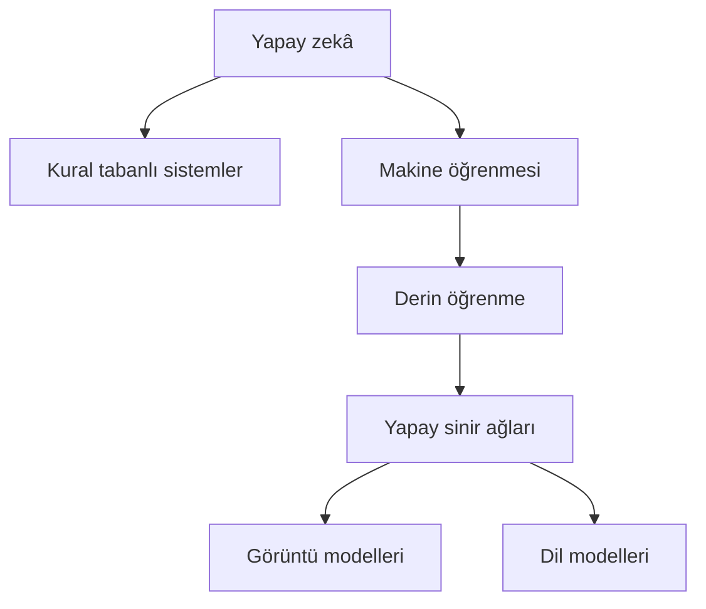
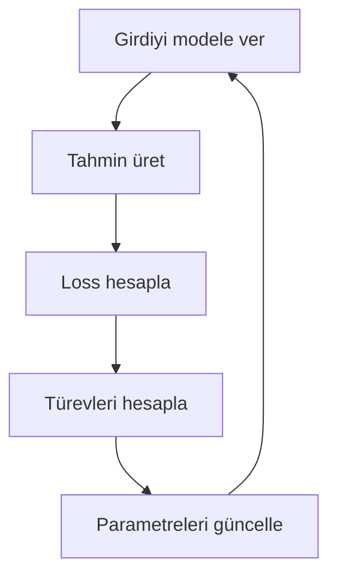
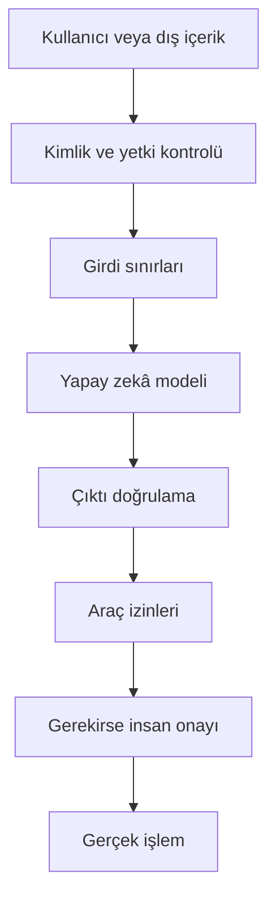
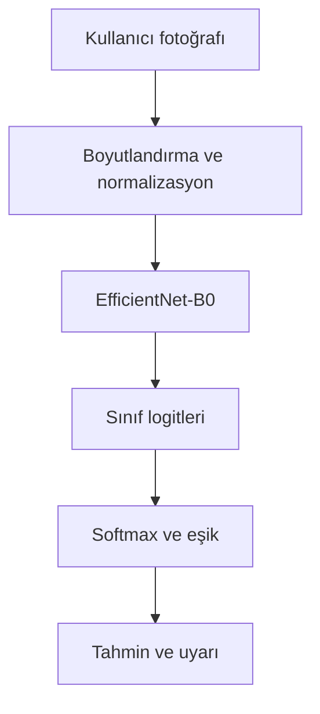

# Yapay Zekâ Nasıl Çalışır?

> Yapay zekânın temel mantığını; matematik, PyTorch, dil modelleri, görüntü işleme, görsel ve video üretimi, açıklanabilirlik ve güvenlik açısından sıfırdan ele alan araştırma notları.

**Belge türü:** Öğrenme ve araştırma notu  
**Düzey:** Başlangıç → Orta  
**Son güncelleme:** 31 Temmuz 2026

[← README'ye dön](./README.md) · [Canlı interaktif demoyu aç](https://lhasanseker.github.io/yapay-zeka-nasil-calisir/)

---

## İçindekiler

1. Yapay zekâ nedir?
2. Yapay zekâ nasıl ortaya çıktı?
3. Klasik programlama ile makine öğrenmesi arasındaki fark
4. Bilgisayar veriyi nasıl temsil eder?
5. Yapay nöronun matematiği
6. Model, ağırlıkları nasıl öğrenir?
7. PyTorch nedir ve koddan model nasıl ortaya çıkar?
8. Büyük dil modelleri nasıl çalışır?
9. Yapay zekâ bir görseli nasıl görür?
10. CNN ile sayısal görüntü analizi
11. Vision Transformer ve görsel tokenlar
12. Görsel üreten modeller nasıl çalışır?
13. Video üreten modeller nasıl çalışır?
14. Yapay zekâ yeni fikir üretebilir mi?
15. Yapay zekâya neden kara kutu denir?
16. Yapay zekâ neden hata yapar?
17. Yapay zekâ güvenliği ve güvenlik açıkları
18. Örnek proje: Üzüm yaprağı hastalık sınıflandırması
19. Öğrenme yol haritası
20. Terimler sözlüğü
21. Sonuç
22. Birincil kaynaklar ve ileri okuma

---

## 1. Yapay zekâ nedir?

Yapay zekâ, bilgisayarların normalde insan zekâsıyla ilişkilendirdiğimiz görevleri yerine getirmesini amaçlayan yöntemlerin genel adıdır.

Örnek görevler:

- Bir fotoğraftaki nesneyi tanımak
- Konuşmayı yazıya dönüştürmek
- Bir metni başka dile çevirmek
- Bir yaprağın hastalığını sınıflandırmak
- Sorulara cevap vermek
- Kod üretmek
- Görsel veya video oluşturmak
- Oyunlarda karar vermek

Yapay zekâ tek bir algoritma değildir. Birçok yöntemi kapsayan geniş bir araştırma alanıdır.



### 1.1. Yapay zekâ, makine öğrenmesi ve derin öğrenme

| Kavram | Kısa açıklama |
|---|---|
| Yapay zekâ | Akıllı davranış gösteren sistemlerin genel alanı |
| Makine öğrenmesi | Kuralları tek tek yazmak yerine veriden örüntü öğrenme yöntemi |
| Derin öğrenme | Çok katmanlı yapay sinir ağlarına dayanan makine öğrenmesi yaklaşımı |
| Üretken yapay zekâ | Metin, görüntü, ses, kod veya video gibi yeni içerikler üreten modeller |

Her derin öğrenme sistemi makine öğrenmesidir ve her makine öğrenmesi sistemi yapay zekâ alanına girer. Ancak her yapay zekâ sistemi derin öğrenme kullanmak zorunda değildir.

### 1.2. Yapay zekâ sihirli bir varlık değildir

Bir yapay zekâ sisteminin temelinde şunlar bulunur:

1. Sayılara dönüştürülmüş veri
2. Matematiksel fonksiyonlar
3. Öğrenilebilir parametreler
4. Hatayı ölçen bir loss fonksiyonu
5. Parametreleri değiştiren bir optimizasyon algoritması
6. Çok yüksek miktarda hesaplama

Model insan gibi biyolojik bir beyne sahip değildir. İçeride çok sayıda matris çarpımı, toplama, normalizasyon ve doğrusal olmayan fonksiyon çalışır.

---

## 2. Yapay zekâ nasıl ortaya çıktı?

Yapay zekânın oluşumu tek bir buluşla açıklanamaz. Matematik, istatistik, bilgisayar bilimi, sinirbilim ve elektronik alanlarındaki gelişmelerin birleşimidir.

### 2.1. Kısa tarihçe

- **1940'lar:** Yapay nöronlara ilişkin ilk matematiksel modeller ortaya çıktı.
- **1950:** Alan Turing, makinelerin düşünüp düşünemeyeceğini tartıştı ve sonradan Turing Testi olarak anılacak yaklaşımı önerdi.
- **1956:** Dartmouth çalıştayında “Artificial Intelligence” terimi akademik bir alanın adı olarak kullanıldı.
- **1950–1980:** Sembolik ve kural tabanlı sistemler ön plandaydı.
- **1980–2000:** Uzman sistemler, istatistiksel öğrenme ve yapay sinir ağları gelişti.
- **2010'lar:** Büyük veri kümeleri, GPU'lar ve derin öğrenme görüntü ve konuşma alanlarında önemli başarılar sağladı.
- **2017:** Transformer mimarisi yayımlandı.
- **2020'ler:** Büyük dil modelleri, çok modlu modeller ve difüzyon tabanlı üretim sistemleri yaygınlaştı.

### 2.2. Neden son yıllarda bu kadar gelişti?

Üç ana sebep vardır:

1. **Veri:** İnternet ve dijital sistemler çok büyük veri kümeleri oluşturdu.
2. **Hesaplama:** GPU ve TPU gibi donanımlar büyük matris işlemlerini hızlandırdı.
3. **Algoritmalar:** Backpropagation, daha iyi optimizasyon yöntemleri, CNN, Transformer ve difüzyon gibi mimariler gelişti.

---

## 3. Klasik programlama ile makine öğrenmesi arasındaki fark

### 3.1. Klasik programlama

Klasik programlamada kuralları geliştirici belirler:

```python
calisma_saati = 5

if calisma_saati >= 4:
    print("Geçer")
else:
    print("Kalır")
```

Akış:

```text
Veri + İnsan tarafından yazılmış kurallar → Sonuç
```

Bilgisayar burada öğrenmez. Yalnızca verilen koşulu uygular.

### 3.2. Makine öğrenmesi

Makine öğrenmesinde doğrudan `4 saat` kuralını yazmak yerine geçmiş örnekler verilir:

| Çalışma süresi | Sonuç |
|---:|---|
| 0 | Kaldı |
| 1 | Kaldı |
| 2 | Kaldı |
| 3 | Kaldı |
| 4 | Geçti |
| 5 | Geçti |
| 6 | Geçti |

Model, çalışma süresi ile sonuç arasındaki ilişkiyi örneklerden öğrenmeye çalışır.

```text
Veri + Doğru cevaplar → Öğrenilmiş model
Yeni veri + Öğrenilmiş model → Tahmin
```

Buradaki kritik fark şudur:

> Klasik programda kuralı insan yazar. Makine öğrenmesinde insan, öğrenme düzenini kurar; model kurala benzeyen sayısal ilişkiyi veriden çıkarır.

---

## 4. Bilgisayar veriyi nasıl temsil eder?

Bilgisayar için metin, fotoğraf ve ses doğrudan anlam taşımaz. Önce sayılara dönüştürülür.

| Veri türü | Sayısal temsil örneği |
|---|---|
| Metin | Token kimlikleri ve embedding vektörleri |
| Görüntü | RGB piksel değerleri |
| Ses | Zamana göre örneklenmiş dalga değerleri veya spektrogram |
| Tablo | Yaş, gelir, sıcaklık gibi sayısal özellikler |
| Video | Zaman boyunca sıralanmış görüntü tensorları |

### 4.1. Tensor nedir?

Tensor, sayıların düzenli ve çok boyutlu bir yapıda tutulmasıdır.

```python
import torch

skaler = torch.tensor(5.0)
vektor = torch.tensor([1.0, 2.0, 3.0])
matris = torch.tensor([
    [1.0, 2.0],
    [3.0, 4.0]
])
```

- Tek sayı: skaler
- Tek boyutlu liste: vektör
- Satır ve sütunlar: matris
- Daha çok boyutlu yapı: tensor

Renkli bir görüntünün şekli çoğunlukla şöyledir:

```text
[kanal, yükseklik, genişlik]
```

Örneğin:

```text
[3, 224, 224]
```

Buradaki `3`, kırmızı, yeşil ve mavi renk kanallarıdır.

Bir grup görüntünün tensor şekli ise şöyle olabilir:

```text
[batch, kanal, yükseklik, genişlik]
[32, 3, 224, 224]
```

Bu, modele aynı anda 32 adet renkli 224×224 görüntü verildiğini anlatır.

---

## 5. Yapay nöronun matematiği

En basit yapay nöron, girişleri ağırlıklarla çarpar, toplar ve bias ekler:

\[
z = w_1x_1+w_2x_2+\dots+w_nx_n+b
\]

Vektör gösterimi:

\[
z=\mathbf{w}^{T}\mathbf{x}+b
\]

Burada:

- \(x\): Giriş özellikleri
- \(w\): Öğrenilebilir ağırlıklar
- \(b\): Öğrenilebilir bias
- \(z\): Doğrusal hesap sonucu

### 5.1. Sayısal nöron örneği

Bir yaprağı iki özelliğe göre sınıflandırdığımızı düşünelim:

- \(x_1=0.9\): Kahverengi leke yoğunluğu
- \(x_2=0.6\): Sararma yoğunluğu

Model ağırlıkları:

\[
w_1=0.8,\quad w_2=0.5,\quad b=-0.4
\]

Hesap:

\[
z=(0.8\times0.9)+(0.5\times0.6)-0.4
\]

\[
z=0.72+0.30-0.40=0.62
\]

### 5.2. Aktivasyon fonksiyonu

Nöron çıktısı çoğunlukla bir aktivasyon fonksiyonundan geçirilir:

\[
y=f(z)
\]

Sigmoid fonksiyonu:

\[
\sigma(z)=\frac{1}{1+e^{-z}}
\]

Bu fonksiyon sonucu 0 ile 1 arasına getirir:

\[
\sigma(0.62)\approx0.650
\]

Model yaklaşık `0.65` değerinde bir çıktı üretir. Bu değer uygun bir problemde yüzde 65 sınıf olasılığı şeklinde yorumlanabilir.

ReLU fonksiyonu ise:

\[
ReLU(z)=\max(0,z)
\]

şeklindedir. Negatif değerleri sıfırlar, pozitif değerleri korur. Derin sinir ağlarında doğrusal olmayan ilişkilerin öğrenilmesine yardımcı olur.

---

## 6. Model, ağırlıkları nasıl öğrenir?

Modelin öğrendiği temel değerler ağırlıklar ve bias'lardır. Bunlara **parametre** denir.

Başlangıçta bu değerler çoğunlukla küçük rastgele sayılardır. Eğitim sırasında şu döngü uygulanır:



### 6.1. İleri yayılım

Modelin girdiden tahmin üretmesine **forward pass**, yani ileri yayılım denir.

\[
x \rightarrow wx+b \rightarrow \sigma(z) \rightarrow \hat{y}
\]

Buradaki \(\hat{y}\), modelin tahminidir.

### 6.2. Loss fonksiyonu

Loss, tahminle doğru cevap arasındaki hatayı sayısal olarak ölçer.

Regresyonda sık kullanılan ortalama karesel hata:

\[
MSE=\frac{1}{N}\sum_{i=1}^{N}(y_i-\hat{y}_i)^2
\]

İkili sınıflandırmada Binary Cross Entropy:

\[
L=-[y\ln(p)+(1-y)\ln(1-p)]
\]

### 6.3. Gradyan inişi

Amaç loss'u küçültmektir. Bunun için loss'un parametrelere göre türevi hesaplanır:

\[
\frac{\partial L}{\partial w},\qquad \frac{\partial L}{\partial b}
\]

Parametre güncelleme kuralı:

\[
w_{yeni}=w_{eski}-\eta\frac{\partial L}{\partial w}
\]

\[
b_{yeni}=b_{eski}-\eta\frac{\partial L}{\partial b}
\]

Buradaki \(\eta\), learning rate yani öğrenme hızıdır.

Gradyanı bir yokuşun eğimi gibi düşünebiliriz. Model, loss yüzeyinde aşağı yönü gösteren eğimi hesaplar ve o yönde küçük adımlar atar.

### 6.4. Adım adım sayısal eğitim örneği

Bir öğrencinin çalışma süresinden geçip geçmediğini tahmin edelim:

```text
x = 2 saat
y = 1, yani geçti
w = 0
b = 0
```

İlk tahmin:

\[
z=wx+b=(0\times2)+0=0
\]

\[
p=\sigma(0)=0.5
\]

Binary Cross Entropy:

\[
L=-\ln(0.5)\approx0.693
\]

Sigmoid ve Binary Cross Entropy birlikte kullanıldığında logit'e göre türev:

\[
\frac{\partial L}{\partial z}=p-y
\]

\[
p-y=0.5-1=-0.5
\]

Ağırlık gradyanı:

\[
\frac{\partial L}{\partial w}=(p-y)x=(-0.5)\times2=-1
\]

Bias gradyanı:

\[
\frac{\partial L}{\partial b}=p-y=-0.5
\]

Learning rate \(\eta=0.1\) olsun:

\[
w_{yeni}=0-(0.1\times-1)=0.1
\]

\[
b_{yeni}=0-(0.1\times-0.5)=0.05
\]

Yeni tahmin:

\[
z=(0.1\times2)+0.05=0.25
\]

\[
p=\sigma(0.25)\approx0.562
\]

Yeni loss:

\[
L=-\ln(0.562)\approx0.576
\]

| Aşama | \(w\) | \(b\) | Tahmin | Loss |
|---|---:|---:|---:|---:|
| Başlangıç | 0.00 | 0.00 | 0.500 | 0.693 |
| 1. güncelleme | 0.10 | 0.05 | 0.562 | 0.576 |

Loss `0.693` değerinden `0.576` değerine düşmüştür. Model bir adımda doğru cevabı bulmaz; küçük iyileştirmeleri binlerce kez tekrarlar.

### 6.5. Backpropagation

Derin bir ağda çıktı milyonlarca işlemden geçerek oluşur. **Backpropagation**, zincir kuralını kullanarak loss'un her parametreye etkisini sondan başa hesaplar.

\[
\frac{\partial L}{\partial w}
=
\frac{\partial L}{\partial y}
\frac{\partial y}{\partial z}
\frac{\partial z}{\partial w}
\]

PyTorch bu türevleri `autograd` sistemiyle otomatik hesaplar.

### 6.6. Batch, epoch ve optimizer

- **Batch:** Aynı anda işlenen örnek grubu
- **Epoch:** Eğitim kümesinin tamamının bir kez görülmesi
- **Optimizer:** Gradyanları kullanarak parametreleri güncelleyen yöntem
- **Learning rate:** Güncelleme adımının büyüklüğü

Sık kullanılan optimizer'lar:

- SGD
- Adam
- AdamW

### 6.7. “Doğru ağırlık” ne demektir?

Model evrensel ve tek bir doğru parametre kümesini bulmak zorunda değildir. Eğitim verisindeki toplam hatayı azaltan uygun parametreler bulur. Veri yanlış, eksik veya yanlıysa model de yanlış ilişki öğrenebilir.

```text
Kötü veri → Yanlış örüntü → Yanlış ağırlıklar → Kötü tahmin
```

---

## 7. PyTorch nedir ve koddan model nasıl ortaya çıkar?

PyTorch, tensor işlemleri, sinir ağı katmanları, otomatik türev ve GPU desteği sağlayan açık kaynaklı bir makine öğrenmesi kütüphanesidir.

PyTorch şunları sağlar:

- `torch.Tensor`: Çok boyutlu sayısal veri
- `torch.nn`: Sinir ağı katmanları
- `torch.autograd`: Otomatik türev
- `torch.optim`: Optimizasyon algoritmaları
- `torchvision`: Görüntü veri kümeleri, dönüşümler ve modeller
- CUDA desteği: NVIDIA GPU üzerinde hesaplama

PyTorch kendi başına hazır bir yapay zekâ değildir. Öğrenebilen matematiksel yapıyı kurmak ve eğitmek için kullanılan araçtır.

### 7.1. Küçük bir PyTorch modeli

Aşağıdaki model, çalışma süresinden öğrencinin geçme olasılığını öğrenir:

```python
import torch
import torch.nn as nn
import torch.optim as optim

# Tekrarlanabilir başlangıç
torch.manual_seed(42)

# Eğitim verisi: çalışma saatleri
x_train = torch.tensor([
    [0.0], [1.0], [2.0], [3.0],
    [4.0], [5.0], [6.0], [7.0]
])

# 0 = kaldı, 1 = geçti
y_train = torch.tensor([
    [0.0], [0.0], [0.0], [0.0],
    [1.0], [1.0], [1.0], [1.0]
])

# Tek girişli, tek çıkışlı doğrusal model
model = nn.Linear(in_features=1, out_features=1)

# Sayısal kararlılık için sigmoid'i loss içine alan yapı
loss_fn = nn.BCEWithLogitsLoss()

optimizer = optim.SGD(model.parameters(), lr=0.1)

for epoch in range(2000):
    # 1. İleri yayılım
    logits = model(x_train)

    # 2. Hata hesabı
    loss = loss_fn(logits, y_train)

    # 3. Önceki gradyanları temizle
    optimizer.zero_grad()

    # 4. Yeni gradyanları hesapla
    loss.backward()

    # 5. Parametreleri güncelle
    optimizer.step()

    if epoch % 200 == 0:
        print(f"Epoch={epoch:4d} Loss={loss.item():.4f}")

# Tahmin modu
model.eval()

with torch.no_grad():
    yeni_ogrenci = torch.tensor([[4.5]])
    logit = model(yeni_ogrenci)
    olasilik = torch.sigmoid(logit)

print(f"Geçme olasılığı: {olasilik.item():.3f}")
print("Karar:", "Geçer" if olasilik.item() >= 0.5 else "Kalır")
```

### 7.2. Kodda gerçekten ne öğreniliyor?

`nn.Linear(1, 1)` içinde öğrenilebilir iki temel değer vardır:

```text
weight = w
bias   = b
```

Başlangıçta bunlar rastgeledir. `loss.backward()` gradyanları hesaplar, `optimizer.step()` değerleri günceller.

Parametreleri incelemek için:

```python
print("Ağırlık:", model.weight.item())
print("Bias:", model.bias.item())
```

Gradyanları bir eğitim adımından sonra incelemek için:

```python
print(model.weight.grad)
print(model.bias.grad)
```

### 7.3. Modeli kaydetme ve yükleme

```python
torch.save(model.state_dict(), "ogrenci_modeli.pth")
```

Yükleme:

```python
model = nn.Linear(1, 1)
model.load_state_dict(
    torch.load("ogrenci_modeli.pth", weights_only=True)
)
model.eval()
```

Model dosyasında `Öğrenci 4 saat çalışırsa geçer` gibi açık bir cümle bulunmaz. Öğrenilen ilişki ağırlık ve bias gibi sayısal parametrelerde temsil edilir.

### 7.4. GPU neden kullanılır?

Sinir ağları çok sayıda matris çarpımı yapar. GPU'lar aynı anda çok sayıda benzer hesabı paralel çalıştırabildiği için büyük modellerde önemli hız kazandırır.

```python
device = torch.device("cuda" if torch.cuda.is_available() else "cpu")
model = model.to(device)
x_train = x_train.to(device)
y_train = y_train.to(device)
```

---

## 8. Büyük dil modelleri nasıl çalışır?

Büyük dil modellerinin temel eğitim hedeflerinden biri, önceki metne bakarak sıradaki tokenı tahmin etmektir.

```text
“Türkiye'nin başkenti ...”
```

Model bir olasılık dağılımı üretebilir:

```text
Ankara    0.96
İstanbul  0.02
İzmir     0.01
Diğer     0.01
```

Seçilen token bağlama eklenir ve işlem yeniden yapılır.

### 8.1. Tokenization

Metin önce token adı verilen parçalara ayrılır. Token her zaman tam kelime değildir; kelime parçası, işaret veya karakter dizisi olabilir.

```text
Metin → Tokenlar → Token kimlikleri
```

### 8.2. Embedding

Her token, çok boyutlu bir sayı vektörüne dönüştürülür:

```text
kedi  → [ 0.82, 0.13, -0.42, ...]
köpek → [ 0.78, 0.17, -0.39, ...]
araba → [-0.21, 0.91,  0.14, ...]
```

Benzer bağlamlarda kullanılan tokenların vektörleri, öğrenilmiş uzayda bazı yönlerden birbirine yakın olabilir.

### 8.3. Transformer ve attention

Transformer, dizideki tokenların birbirleriyle ilişkilerini attention ile hesaplar.

Her token için üç temsil oluşturulur:

- **Query (Q):** Hangi bilgiye ihtiyacım var?
- **Key (K):** Hangi bilgiyi temsil ediyorum?
- **Value (V):** Taşıdığım içerik nedir?

Scaled dot-product attention:

\[
Attention(Q,K,V)=softmax\left(\frac{QK^T}{\sqrt{d_k}}\right)V
\]

Basitleştirilmiş süreç:

1. Query ile key'ler arasındaki benzerlik hesaplanır.
2. Sonuçlar ölçeklenir.
3. Softmax ile ağırlıklara dönüştürülür.
4. Value vektörleri bu ağırlıklara göre birleştirilir.

Multi-head attention, farklı ilişki türlerini paralel olarak öğrenebilmek için bu işlemi birden fazla başlıkta yapar.

### 8.4. Model bilgiyi nerede tutar?

Bilgi normal bir veritabanındaki cümleler gibi saklanmaz. Çok sayıda parametre arasına dağıtılmış sayısal ilişkiler hâlindedir. Bu nedenle model:

- Bildiği bir bilgiyi doğru üretebilir.
- Eksik bilgiyi benzer örüntülerle tamamlayabilir.
- Akıcı fakat yanlış bir cevap üretebilir.

### 8.5. Eğitim ve inference farkı

| Aşama | Ne olur? |
|---|---|
| Pretraining | Büyük veri üzerinde genel örüntüler öğrenilir |
| Fine-tuning | Model belirli görev veya örneklere uyarlanır |
| Tercih/güvenlik eğitimi | İstenen davranışlar güçlendirilir |
| Inference | Kullanıcı girdisine cevap üretilir; ana ağırlıklar normalde değişmez |

Kullanıcının promptu modelin ağırlıklarını değiştirmez. O anki bağlamı ve iç aktivasyonları değiştirerek üretilecek tokenların dağılımını yönlendirir.

### 8.6. Temperature

Temperature üretim dağılımını etkiler:

- Düşük temperature: Daha tutarlı ve öngörülebilir
- Yüksek temperature: Daha çeşitli, fakat hata ihtimali daha yüksek

Modelin cevabı yalnızca “kelimeleri rastgele birleştirmesi” değildir. Sıradaki tokenı başarıyla tahmin edebilmek için dilbilgisi, bağlam, kavram ilişkileri ve birçok problem çözme örüntüsünü parametrelerinde temsil eder. Ancak bu durum tek başına insan bilinci anlamına gelmez.

---

## 9. Yapay zekâ bir görseli nasıl görür?

Modelin biyolojik gözü yoktur. Gerçek dünyadaki ışığı sayılara dönüştüren araç kameradır.

```text
Nesneden yansıyan ışık
→ Kamera merceği
→ CMOS/CCD sensörü
→ Elektrik sinyali
→ Sayısal RGB değerleri
→ Görüntü dosyası
→ Yapay zekâ modeli
```

Fotoğraf zaten dosyadaysa yeniden kameraya ihtiyaç yoktur; piksel değerleri daha önce oluşturulmuştur.

### 9.1. Piksel nedir?

Bir RGB piksel üç sayı içerir:

```text
Kırmızı = [255,   0,   0]
Yeşil   = [  0, 255,   0]
Mavi    = [  0,   0, 255]
Beyaz   = [255, 255, 255]
Siyah   = [  0,   0,   0]
```

Model renkleri hissetmez. Sayılar üzerinde işlem yapar. Örneğin parlaklık değerleri `20` ve `220` olan iki komşu pikselin farkı:

\[
220-20=200
\]

Büyük fark, güçlü bir renk veya parlaklık geçişine işaret edebilir.

### 9.2. İnsan gözüyle karşılaştırma

İnsan gözünde ışık, retinadaki hücreleri uyarır ve elektriksel sinyaller beyne gider. Kamera da ışığı elektronik ve sayısal sinyallere dönüştürür. Modelin yaptığı iş, bu sayısal sinyallerdeki ilişkileri hesaplamaktır.

Termometrenin sıcaklığı insan gibi hissetmesine gerek olmadığı gibi, modelin de renk farkını insan gibi görmesine gerek yoktur.

---

## 10. CNN ile sayısal görüntü analizi

CNN, yani Convolutional Neural Network, görüntü üzerinde öğrenilmiş küçük filtreler gezdirerek özellik haritaları çıkarır.

### 10.1. Somut piksel ve convolution örneği

Aşağıdaki 3×3 gri tonlu görüntü parçasında solda karanlık, sağda aydınlık alan vardır:

\[
X=
\begin{bmatrix}
10&10&240\\
10&10&240\\
10&10&240
\end{bmatrix}
\]

Dikey kenara tepki verebilen örnek filtre:

\[
K=
\begin{bmatrix}
-1&0&1\\
-1&0&1\\
-1&0&1
\end{bmatrix}
\]

Elemanlar çarpılıp toplanır:

\[
(10\times-1)+(10\times0)+(240\times1)
\]

Bu işlem üç satır için yapılır:

\[
(-10+0+240)+(-10+0+240)+(-10+0+240)=690
\]

`690` gibi büyük pozitif sonuç, o bölgede güçlü bir dikey geçiş olduğunu gösterir.

Bu filtrenin negatif yöndeki karşılığına denk gelinse büyük negatif değer oluşabilir. Aktivasyon veya sonraki katmanlar bu bilgiyi kullanır.

Aynı hesabın küçük ve çalıştırılabilir PyTorch karşılığı:

```python
import torch
import torch.nn.functional as F

# 1 görüntü, 1 kanal, 3 satır, 3 sütun
image = torch.tensor([[[[
    10.0, 10.0, 240.0,
], [
    10.0, 10.0, 240.0,
], [
    10.0, 10.0, 240.0,
]]]])

# 1 çıktı filtresi, 1 giriş kanalı, 3x3 kernel
kernel = torch.tensor([[[[
    -1.0, 0.0, 1.0,
], [
    -1.0, 0.0, 1.0,
], [
    -1.0, 0.0, 1.0,
]]]])

feature_map = F.conv2d(image, kernel)

print("Görüntü şekli:", image.shape)
print("Filtre sonucu:", feature_map.item())
```

Beklenen çıktı:

```text
Görüntü şekli: torch.Size([1, 1, 3, 3])
Filtre sonucu: 690.0
```

Gerçek modelde filtre değerleri elle yazılmak zorunda değildir. Başlangıçta rastgele olan filtreler eğitim sırasında backpropagation ile öğrenilir.

### 10.2. Özellik hiyerarşisi

CNN katmanları ilerledikçe daha karmaşık örüntüler temsil edebilir:

```text
Pikseller
→ Kenar ve renk geçişleri
→ Köşe ve basit dokular
→ Leke, damar veya nesne parçaları
→ Sınıfa ilişkin karmaşık örüntüler
```

Bir üzüm yaprağı modelinde katmanlar şunlara tepki geliştirebilir:

- Yaprak kenarları
- Kahverengi lekeler
- Sararma bölgeleri
- Damar yapısı
- Leke çevresindeki doku

Ancak model istenmeyen ilişkileri de öğrenebilir:

- Arka plan rengi
- Fotoğrafın çekildiği masa
- Kamera türü
- Etiket veya filigran

Bu nedenle yüksek doğruluk tek başına modelin doğru biyolojik özelliği öğrendiğini kanıtlamaz.

### 10.3. Logit ve softmax

Çok sınıflı modelin son katmanı her sınıf için bir logit üretebilir:

```text
Sağlıklı:  1.0
Black Rot: 3.0
Esca:      0.0
```

Softmax:

\[
P(y=i)=\frac{e^{z_i}}{\sum_j e^{z_j}}
\]

Yaklaşık hesap:

\[
e^1=2.718,\quad e^3=20.086,\quad e^0=1
\]

Toplam:

\[
2.718+20.086+1=23.804
\]

Sonuç:

```text
Sağlıklı  ≈ %11.4
Black Rot ≈ %84.4
Esca      ≈ %4.2
```

Softmax çıktısı yüksek olsa bile bunun gerçek dünyadaki güvenilirlikle otomatik olarak aynı olmadığı unutulmamalıdır. Model kalibrasyonu ayrıca incelenmelidir.

### 10.4. EfficientNet

EfficientNet ailesi CNN tabanlıdır. Ağın derinliğini, genişliğini ve giriş çözünürlüğünü dengeli biçimde ölçeklemeyi amaçlar. EfficientNet-B0, transfer learning için kullanılabilen görece verimli bir başlangıç modelidir.

Transfer learning süreci:

1. Genel görüntüler üzerinde önceden eğitilmiş model alınır.
2. Son sınıflandırma katmanı proje sınıflarına göre değiştirilir.
3. Önce yalnızca yeni katmanlar eğitilebilir.
4. Daha sonra modelin bir bölümü düşük learning rate ile fine-tune edilebilir.

---

## 11. Vision Transformer ve görsel tokenlar

Vision Transformer, görüntüyü sabit boyutlu parçalara, yani patch'lere böler.

224×224 görüntü 16×16 patch'lere ayrılırsa:

\[
224/16=14
\]

Her yönde 14 patch oluşur:

\[
14\times14=196\ patch
\]

Her RGB patch içindeki sayı adedi:

\[
16\times16\times3=768
\]

Her patch düzleştirilir ve doğrusal dönüşümle embedding'e çevrilir. Patch'lere konum bilgisi eklenir; aksi hâlde model parçaların nerede bulunduğunu ayırt etmekte zorlanır.

```text
Görüntü
→ Patch'ler
→ Patch embedding'leri
→ Konum bilgisi
→ Transformer katmanları
→ Sınıflandırma veya başka bir çıktı
```

Self-attention, uzaktaki görüntü bölgeleri arasındaki ilişkileri hesaplayabilir. Örneğin yaprağın merkezindeki lekeyle kenarındaki sararmanın ilişkisini değerlendirebilir.

### 11.1. Çok modlu modeller

Görsel anlayan bir dil modelinde genel akış:

1. Görsel tensor hâline getirilir.
2. Görsel kodlayıcı patch'leri vektörlere dönüştürür.
3. Görsel temsiller dil modelinin kullanabileceği boyuta yansıtılır.
4. Görsel tokenlar ve metin tokenları ortak bağlamda işlenir.
5. Model cevabı metin tokenları olarak üretir.

```text
[Görsel tokenlar] + [“Bu yaprakta hastalık var mı?” tokenları]
→ Çok modlu model
→ Metin cevabı
```

Model, görüntüyü mutlaka önce eksiksiz bir yazılı açıklamaya çevirmek zorunda değildir. Görsel vektörleri doğrudan dil modeli bağlamına bağlanabilir.

---

## 12. Görsel üreten modeller nasıl çalışır?

Görüntü sınıflandırmada akış:

```text
Görsel → Sınıf veya açıklama
```

Görsel üretiminde:

```text
Metin ve rastgele gürültü → Yeni görsel
```

Modern üretim sistemlerinde difüzyon, latent diffusion, diffusion transformer ve flow tabanlı yaklaşımlar kullanılabilir. Bu bölüm temel difüzyon mantığını anlatır.

### 12.1. Difüzyon eğitimi

Eğitim sırasında gerçek görüntüye belirli miktarda Gauss gürültüsü eklenir:

\[
x_t=\sqrt{\bar{\alpha}_t}x_0+\sqrt{1-\bar{\alpha}_t}\epsilon
\]

Burada:

- \(x_0\): Temiz görüntü
- \(x_t\): Gürültülü görüntü
- \(t\): Gürültü seviyesi/zaman adımı
- \(\epsilon\): Rastgele Gauss gürültüsü
- \(\bar{\alpha}_t\): O adımda ne kadar görüntü bilgisinin korunduğunu belirleyen katsayı

Model, gürültülü görüntüden eklenen gürültüyü tahmin etmeyi öğrenebilir:

\[
\epsilon_\theta(x_t,t,c)
\]

Buradaki \(c\), metin koşulu gibi ek bilgidir.

Basitleştirilmiş loss:

\[
L=\mathbb{E}\left[\|\epsilon-\epsilon_\theta(x_t,t,c)\|^2\right]
\]

Modelin tahmin ettiği gürültü gerçek gürültüye yaklaştıkça loss küçülür.

### 12.2. Görsel üretimi

Üretimde temiz görüntü yoktur. Rastgele gürültüden başlanır:

\[
x_T\sim\mathcal{N}(0,I)
\]

Model, gürültüyü birçok adımda azaltarak metne uygun örneğe dönüştürür:

```text
Rastgele gürültü
→ Kaba renk ve yerleşim
→ Nesne şekilleri
→ Doku ve ışık
→ Ayrıntılı görüntü
```

### 12.3. Prompt görüntüyü nasıl yönlendirir?

Prompt tokenlara ve embedding'lere dönüştürülür. Görsel üretim ağı, cross-attention gibi mekanizmalarla metin temsillerini görüntü temsilleriyle ilişkilendirir.

Örnek prompt:

```text
“Gün batımında üzüm bağında duran kırmızı bir traktör”
```

Öğrenilmiş ilişkiler:

- `kırmızı` → renk özellikleri
- `traktör` → nesne şekli
- `üzüm bağı` → çevre düzeni
- `gün batımı` → ışık, gölge ve renk paleti

### 12.4. Latent space ve VAE

Yüksek çözünürlükte doğrudan milyonlarca piksel üzerinde çalışmak pahalıdır. Bu nedenle birçok sistem görüntüyü daha küçük bir latent temsile kodlar:

```text
Piksel görüntüsü
→ VAE encoder
→ Latent temsil
→ Difüzyon işlemi
→ Temiz latent
→ VAE decoder
→ Piksel görüntüsü
```

Latent temsil, görüntünün model tarafından öğrenilmiş sıkıştırılmış sayısal gösterimidir.

### 12.5. Üretilen görüntü hazır dosyadan mı alınır?

Genellikle model bir klasörden hazır görüntü seçmez. Eğitim sırasında öğrendiği renk, şekil, doku, perspektif ve kavram ilişkilerini kullanarak yeni piksel düzeni üretir. Bununla birlikte büyük modeller bazı örnekleri kısmen ezberleyebilir; gizlilik, veri lisansı ve telif sorunları bu nedenle önemlidir.

---

## 13. Video üreten modeller nasıl çalışır?

Video, zaman boyunca sıralanmış görüntülerden oluşur. Görüntü tensörüne zaman boyutu eklenir:

```text
[batch, zaman, kanal, yükseklik, genişlik]
```

Örnek:

```text
[1, 24, 3, 512, 512]
```

Bu tensor; 24 karelik, renkli, 512×512 bir videoyu temsil edebilir.

### 13.1. Uzamsal ve zamansal ilişki

Video modeli iki tür tutarlılık öğrenmelidir:

- **Uzamsal:** Tek kare içindeki nesne ve parçaların ilişkisi
- **Zamansal:** Nesnenin farklı karelerdeki hareketi ve devamlılığı

Örneğin:

```text
Kare 1: Kişinin ayağı geride
Kare 2: Ayağı öne hareket ediyor
Kare 3: Vücut ağırlığı öne aktarılıyor
```

Model 3B convolution, zamansal attention veya uzay-zaman patch'leri gibi yapılarla kareler arası ilişki kurabilir.

### 13.2. Video difüzyonu

Basitleştirilmiş süreç:

1. Video klibine uzamsal ve zamansal gürültü eklenir.
2. Model gürültüyü tahmin etmeyi öğrenir.
3. Üretimde zamansal gürültü tensorundan başlanır.
4. Kareler birlikte temizlenir.
5. Model nesne kimliğini ve hareketi korumaya çalışır.

Her kare bağımsız üretilirse yüz, kıyafet ve arka plan sürekli değişebilir. Bu nedenle zaman boyutu birlikte modellenir.

### 13.3. Video üretimi neden daha zordur?

Model yalnızca tek bir görüntüyü değil, kareler boyunca şunları korumalıdır:

- Karakter kimliği
- Nesne şekli
- Kıyafet rengi
- Işık ve gölge
- Kamera hareketi
- Fiziksel devamlılık
- Hareket yönü

Yaygın hatalar:

- Nesnelerin kaybolması
- Yüzün veya kıyafetin değişmesi
- Parmakların birleşmesi
- Arka planın erimesi
- Fiziksel olarak anlamsız hareket

Bu hatalar, modelin her zaman gerçek bir fizik motoru gibi simülasyon yapmamasından kaynaklanabilir. Model çoğunlukla eğitim verilerinde olası görünen uzay-zaman örüntülerini öğrenir.

---

## 14. Yapay zekâ yeni fikir üretebilir mi?

Bu soru `yeni` kavramının tanımına bağlıdır.

Model eğitimden şunları öğrenebilir:

- Kavramlar
- Nesneler arasındaki ilişkiler
- Yazım ve tasarım biçimleri
- Problem çözme örüntüleri
- Görsel ve dilsel yapılar

Sonra bunları daha önce birebir görmediği bir kombinasyonda birleştirebilir:

```text
Üzüm hastalığı tespiti
+ Drone görüntüsü
+ Ziraat mühendisi onayı
+ Mobil uygulama
= Yeni bir sistem tasarımı
```

Dolayısıyla model:

- Yeni cümleler
- Yeni kod kombinasyonları
- Yeni görsel düzenler
- Yeni tasarım önerileri
- Kavramların yeni birleşimleri

üretebilir.

Fakat bu tamamen yoktan oluşturma değildir. Üretim, öğrenilmiş örüntülerin yeni bir bağlamda birleştirilmesine dayanır. Ayrıca günümüzdeki modellerin insan gibi bilinçli amaç, duygu ve yaşam deneyimine sahip olduğu varsayılmamalıdır.

---

## 15. Yapay zekâya neden kara kutu denir?

Klasik programda bir kararın sebebi açıktır:

```python
if yas >= 18:
    sonuc = "Yetişkin"
```

Derin öğrenmede sonuç milyonlarca veya milyarlarca parametrenin ortak etkisiyle oluşur. Bütün ağırlıkları görebiliriz:

```text
0.0312, -0.8174, 0.0009, ...
```

Ancak tek bir ağırlığın insan dilinde anlamını açıklamak çoğu zaman mümkün değildir. Bilgi ağın birçok bölümüne dağıtılmıştır.

Kara kutu, modelin içinde hiçbir şey görülemediği anlamına gelmez. Şunlar incelenebilir:

- Mimari
- Katmanlar
- Parametreler
- Ara aktivasyonlar
- Gradyanlar
- Attention haritaları
- Giriş-çıkış davranışları

Sorun, bunları eksiksiz ve güvenilir bir insan açıklamasına dönüştürmenin zor olmasıdır.

### 15.1. Açıklanabilirlik yöntemleri

| Yöntem | Amaç |
|---|---|
| Grad-CAM | CNN kararında etkili görüntü bölgelerini yaklaşık gösterir |
| SHAP | Özelliklerin tahmine katkısını tahmin eder |
| LIME | Belirli bir tahmini yerel ve daha basit bir modelle yaklaşık açıklar |
| Feature visualization | Katmanların hangi örüntülere tepki verdiğini araştırır |
| Attention visualization | Token veya patch ilişkilerini görselleştirir |

Grad-CAM'de hedef sınıfın gradyanları son convolution katmanındaki özellik haritalarıyla ilişkilendirilir ve kaba bir ısı haritası üretilir.

Önemli sınır:

> Isı haritası modelin düşüncesinin eksiksiz kanıtı değildir. Kararda etkili görünen bölgeler hakkında yaklaşık bir açıklamadır.

---

## 16. Yapay zekâ neden hata yapar?

### 16.1. Veri sorunları

- Yanlış etiketler
- Yetersiz örnek sayısı
- Sınıf dengesizliği
- Gerçek kullanım ortamını temsil etmeyen veri
- Eğitim ve test arasında kopya görüntüler
- Arka plan veya kamera yanlılığı

### 16.2. Underfitting ve overfitting

**Underfitting:** Model gerekli ilişkiyi öğrenememiştir. Hem eğitim hem test performansı düşüktür.

**Overfitting:** Model eğitim verisini fazla ezberlemiştir. Eğitim başarısı yüksek, yeni veride başarısı düşüktür.

### 16.3. Distribution shift

Eğitim görüntüleri laboratuvar ortamında, gerçek kullanıcı görüntüleri tarlada çekilmişse veri dağılımı değişir:

```text
Eğitim: Temiz arka plan, iyi ışık, ortalanmış yaprak
Gerçek: El, toprak, gölge, bulanıklık, farklı kamera
```

Model gerçek kullanımda daha çok hata yapabilir.

### 16.4. Dil modeli halüsinasyonu

Dil modelinin temel amacı çoğu zaman doğrulanmış veriyi veri tabanından getirmek değil, bağlama uygun token üretmektir. Bilgi eksikken dilsel olarak ikna edici fakat yanlış:

- Kaynak
- Tarih
- Fonksiyon
- Kanun maddesi
- İstatistik

üretebilir.

RAG, araç kullanımı, güvenilir kaynak doğrulaması ve belirsizlik bildirme bu riski azaltabilir; tamamen ortadan kaldırmayabilir.

---

## 17. Yapay zekâ güvenliği ve güvenlik açıkları

Yapay zekâ güvenliği üç katmanda düşünülmelidir:

1. Klasik uygulama güvenliği
2. Modele ve veriye özgü güvenlik
3. Modelin bağlı olduğu araçlar ve yetkiler

### 17.1. Klasik uygulama açıkları

Yapay zekâ uygulaması da sonuçta yazılımdır. Şu riskler bulunabilir:

- Hatalı kimlik doğrulama
- Yetkisiz API erişimi
- SQL injection
- XSS
- SSRF
- Komut enjeksiyonu
- Güvensiz dosya yükleme
- API anahtarı sızıntısı
- Güvensiz bağımlılıklar

### 17.2. Yapay zekâya özgü riskler

| Risk | Açıklama | Temel savunma yaklaşımı |
|---|---|---|
| Prompt injection | Güvenilmeyen metnin modeli asıl görevinden saptırması | Güven sınırları, yetki kontrolü, araç doğrulama |
| Jailbreak | Modelin güvenlik davranışını aşmaya çalışma | Katmanlı filtreleme, değerlendirmeler, en az yetki |
| Data poisoning | Eğitim verisinin yanlış veya kötü niyetli örneklerle bozulması | Veri kaynağı doğrulama, kalite ve aykırı değer kontrolü |
| Backdoor | Belirli gizli tetikleyicide modelin istenmeyen davranması | Veri/model bütünlüğü, tetikleyici ve davranış testleri |
| Adversarial example | Küçük girdi değişiklikleriyle yanlış tahmin oluşturma | Sağlamlık testleri, güvenli ön işleme, izleme |
| Model extraction | Çok sayıda sorguyla modeli taklit etmeye çalışma | Rate limit, erişim kontrolü, anomali tespiti |
| Membership inference | Bir örneğin eğitim verisinde olup olmadığını tahmin etme | Veri minimizasyonu ve gizlilik yöntemleri |
| Hassas veri sızıntısı | Modelin gizli bilgiyi üretmesi | Veri temizliği, erişim kontrolü, çıktı denetimi |
| Improper output handling | Model çıktısının doğrulanmadan çalıştırılması | Şema doğrulama, sanitization, sandbox |
| Excessive agency | Modele gereğinden fazla işlem yetkisi verilmesi | Least privilege ve insan onayı |
| Denial of service | Aşırı büyük veya maliyetli isteklerle sistemi tüketme | Kota, zaman aşımı, maliyet ve hız sınırı |
| Supply-chain riski | Model, veri veya kütüphane kaynağının bozulması | İmza/hash, sürüm sabitleme, güvenilir kaynak |

### 17.3. Prompt injection

Bir yapay zekâ web sayfası, e-posta veya PDF okuyorsa bu içerikte modele hitap eden kötü niyetli talimat bulunabilir. Model belge içeriğini sistem talimatı gibi değerlendirebilir.

Savunma için:

- Dış içerik güvenilmez veri kabul edilmelidir.
- Modelin araç yetkileri sınırlandırılmalıdır.
- Hassas işlemler insan onayı istemelidir.
- Araç parametreleri uygulama katmanında doğrulanmalıdır.
- İzin verilen işlemler açıkça tanımlanmalıdır.
- Gizli veriler modele gereksiz yere verilmemelidir.

### 17.4. Güvenli yapay zekâ sistemi tasarımı



Temel güvenlik ilkesi:

> Modelin her zaman doğru davranacağına güvenmek yerine, model yanlış davransa bile verebileceği zararı sınırlandıran bir sistem tasarlanmalıdır.

### 17.5. Yetkili güvenlik testi

Güvenlik araştırmaları yalnızca sahibinin açıkça izin verdiği sistemlerde yapılmalıdır.

Savunma amaçlı test adımları:

1. Korunacak varlıkları belirle.
2. Modelin okuyabildiği veri ve kullanabildiği araçları listele.
3. Kullanıcı, belge ve araçlar arasındaki güven sınırlarını çiz.
4. Prompt injection, veri sızıntısı ve yetkisiz araç kullanımı senaryoları oluştur.
5. Her testi farklı örneklerle tekrar et.
6. Model sürümü, girdi, çıktı ve araç çağrılarını kaydet.
7. Yetkileri azalt, doğrulama ekle ve aynı testleri yeniden çalıştır.

Tek bir başarılı test güvenliği kanıtlamaz. Üretken modeller olasılıksal olduğu için testlerin tekrar edilmesi ve başarı oranlarının kaydedilmesi gerekir.

---

## 18. Örnek proje: Üzüm yaprağı hastalık sınıflandırması

Amaç:

```text
Giriş: Kullanıcının çektiği üzüm yaprağı fotoğrafı
Çıkış: Hastalık sınıfı + skor + gerektiğinde belirsizlik uyarısı
```

Örnek sınıflar:

```text
healthy
black_rot
esca
leaf_blight
```

### 18.1. Uçtan uca sistem



### 18.2. Veri yapısı

```text
dataset/
├── train/
│   ├── healthy/
│   ├── black_rot/
│   ├── esca/
│   └── leaf_blight/
├── val/
└── test/
```

Veri bölme ilkeleri:

- Aynı veya çok benzer görüntü farklı bölümlere düşmemeli.
- Aynı bitki, video veya çekim serisinden gelen görüntüler grup olarak ayrılmalı.
- Test kümesi gerçek kullanım koşullarını temsil etmeli.
- Test verisi model seçimi için tekrar tekrar kullanılmamalı.

### 18.3. Modeli uyarlama

```python
import torch.nn as nn
from torchvision.models import efficientnet_b0, EfficientNet_B0_Weights

model = efficientnet_b0(
    weights=EfficientNet_B0_Weights.DEFAULT
)

in_features = model.classifier[1].in_features
model.classifier[1] = nn.Linear(in_features, 4)
```

Modelin son katmanı dört sınıfa göre değiştirilmiştir.

### 18.4. Eğitim adımı

```python
for images, labels in train_loader:
    images = images.to(device)
    labels = labels.to(device)

    optimizer.zero_grad()

    logits = model(images)
    loss = criterion(logits, labels)

    loss.backward()
    optimizer.step()
```

Bu döngü, küçük öğrenci modelindeki döngüyle aynı temel mantığa sahiptir. Fark, milyonlarca parametre ve yüksek boyutlu görüntü tensorları kullanılmasıdır.

### 18.5. Değerlendirme

Sadece accuracy yeterli değildir:

- Confusion matrix
- Her sınıf için precision
- Her sınıf için recall
- F1-score
- Sınıf dağılımı
- Kalibrasyon
- Gerçek saha görüntülerinde test
- Düşük güvenli örneklerin incelenmesi

Özellikle hastalık uygulamasında yanlış negatif önemlidir: Hasta yaprağın sağlıklı tahmin edilmesi kullanıcıyı yanıltabilir.

### 18.6. Arka plan yanlılığı

Eğer eğitim verisinde:

```text
Black Rot → Sürekli beyaz arka plan
Healthy   → Sürekli tarla arka planı
```

varsa model hastalık yerine arka planı öğrenebilir. Çözüm yalnızca her fotoğrafı otomatik kırpmak değildir. Daha sağlam yaklaşım:

- Çeşitli gerçek arka planlar
- Farklı kameralar ve ışık koşulları
- Grup temelli güvenli veri bölme
- Grad-CAM incelemesi
- Saha testleri
- Kontrollü veri artırma

### 18.7. Güvenli ürün davranışı

Bu tür sistem bir uzman teşhisinin kesin yerine geçmemelidir. Ürün:

- Belirsizlik gösterebilmeli.
- Düşük skorda kesin hüküm vermemeli.
- Kullanıcıyı uygun uzmana yönlendirebilmeli.
- Model ve veri sürümünü kaydedebilmeli.
- Geri bildirimleri doğrudan doğrulanmadan eğitim verisine eklememelidir.

---

## 19. Öğrenme yol haritası

Yapay zekâyı gerçekten anlamak için önerilen sıra:

1. Python temelleri
2. NumPy ve tensor mantığı
3. Vektör ve matrisler
4. Fonksiyon, türev ve zincir kuralı
5. Olasılık ve temel istatistik
6. Linear regression
7. Logistic regression
8. Loss ve gradient descent
9. Tek nöronun elle yazılması
10. PyTorch autograd
11. Çok katmanlı sinir ağları
12. Train/validation/test ayrımı
13. CNN ve görüntü sınıflandırma
14. Embedding ve attention
15. Transformer ve dil modelleri
16. Difüzyon ve üretken modeller
17. Model değerlendirme ve açıklanabilirlik
18. Yapay zekâ güvenliği

Önerilen küçük projeler:

- NumPy ile doğrusal regresyon
- PyTorch ile geçti/kaldı sınıflandırması
- El yazısı rakam sınıflandırması
- Kedi/köpek sınıflandırması
- Üzüm yaprağı hastalık sınıflandırması
- Küçük metin duygu analizi
- Belgelerden cevap veren RAG uygulaması
- Sınırlı yetkilere sahip güvenli yapay zekâ asistanı

---

## 20. Terimler sözlüğü

| Terim | Açıklama |
|---|---|
| AI | Yapay zekâ alanının genel adı |
| Machine Learning | Veriden örüntü öğrenme yöntemleri |
| Deep Learning | Çok katmanlı sinir ağlarıyla öğrenme |
| Model | Girdiyi çıktıya dönüştüren öğrenilmiş matematiksel yapı |
| Parameter | Modelin eğitimde öğrendiği ağırlık ve bias değerleri |
| Hyperparameter | Learning rate ve batch size gibi geliştiricinin seçtiği ayarlar |
| Tensor | Çok boyutlu sayısal veri yapısı |
| Forward pass | Modelin girdiden tahmin üretmesi |
| Loss | Tahmin hatasının sayısal ölçüsü |
| Gradient | Loss'un bir parametreye göre değişim yönü ve büyüklüğü |
| Backpropagation | Türevlerin ağ boyunca sondan başa hesaplanması |
| Optimizer | Gradyanlarla parametreleri güncelleyen algoritma |
| Epoch | Eğitim kümesinin tamamının bir kez işlenmesi |
| Batch | Birlikte işlenen örnek grubu |
| Inference | Eğitilmiş modelle tahmin üretme |
| Fine-tuning | Önceden eğitilmiş modeli özel göreve uyarlama |
| Token | Metnin model tarafından işlenen parçası |
| Embedding | Bir kavramın sayı vektörüyle temsili |
| Attention | Girdi parçaları arasındaki ilişkileri ağırlıklandırma mekanizması |
| CNN | Görüntüde öğrenilmiş filtrelerle özellik çıkaran ağ |
| Patch | Vision Transformer'ın işlediği görüntü parçası |
| Logit | Olasılığa çevrilmeden önceki ham sınıf puanı |
| Softmax | Logitleri toplamı 1 olan sınıf dağılımına dönüştüren fonksiyon |
| Diffusion | Gürültüyü adım adım azaltarak veri üretmeyi öğrenen yaklaşım |
| Latent space | Verinin öğrenilmiş, sıkıştırılmış sayısal temsil alanı |
| Hallucination | Modelin akıcı fakat yanlış veya uydurma bilgi üretmesi |
| RAG | Harici belgeleri getirip model cevabına bağlayan yöntem |
| Prompt injection | Güvenilmeyen girdinin model talimatlarını saptırması |
| Grad-CAM | CNN kararında etkili bölgeleri yaklaşık gösteren yöntem |

---

## 21. Sonuç

Yapay zekânın temel çalışma mantığı şu döngüde özetlenebilir:

```text
Veriyi sayılara dönüştür
→ Matematiksel modelden geçir
→ Tahmin üret
→ Hatayı ölç
→ Türevleri hesapla
→ Ağırlıkları güncelle
→ Çok kez tekrarla
```

Dil modelinde sayılar token embedding'lerini, görüntü modelinde piksel veya patch temsillerini, video modelinde ise uzay-zaman tensorlarını temsil eder.

Yapay zekâ sihirli veya biyolojik bir varlık değildir. Büyük veri üzerinde eğitilmiş, çok sayıda parametre içeren matematiksel bir sistemdir. Güçlü biçimde genelleme ve üretim yapabilir; fakat hata, yanlılık, veri sızıntısı ve güvenlik sorunları taşıyabilir. Bu nedenle yalnızca modeli değil, veriyi, değerlendirme yöntemini, kullanıcı arayüzünü, araç izinlerini ve bütün uygulama güvenliğini birlikte düşünmek gerekir.

---

## 22. Birincil kaynaklar ve ileri okuma

### Temel öğrenme ve PyTorch

- [PyTorch: Learn the Basics](https://docs.pytorch.org/tutorials/beginner/basics/intro.html)
- [PyTorch: Neural Networks Tutorial](https://docs.pytorch.org/tutorials/beginner/blitz/neural_networks_tutorial.html)
- [PyTorch: A Gentle Introduction to Autograd](https://docs.pytorch.org/tutorials/beginner/blitz/autograd_tutorial.html)
- [PyTorch: Build the Neural Network](https://docs.pytorch.org/tutorials/beginner/basics/buildmodel_tutorial.html)

### Transformer ve görüntü modelleri

- Vaswani ve diğerleri, [Attention Is All You Need](https://arxiv.org/abs/1706.03762), 2017.
- Dosovitskiy ve diğerleri, [An Image is Worth 16×16 Words: Transformers for Image Recognition at Scale](https://arxiv.org/abs/2010.11929), 2020.
- Tan ve Le, [EfficientNet: Rethinking Model Scaling for Convolutional Neural Networks](https://proceedings.mlr.press/v97/tan19a.html), 2019.
- Selvaraju ve diğerleri, [Grad-CAM: Visual Explanations from Deep Networks via Gradient-Based Localization](https://arxiv.org/abs/1610.02391), 2017.

### Üretken modeller

- Ho, Jain ve Abbeel, [Denoising Diffusion Probabilistic Models](https://arxiv.org/abs/2006.11239), 2020.

### Güvenlik

- [OWASP Top 10 for LLM Applications](https://owasp.org/www-project-top-10-for-large-language-model-applications/)
- [OWASP GenAI Security Project: LLM and GenAI Risks](https://genai.owasp.org/llm-top-10/)

---

## Not

Bu belge öğrenme ve araştırma amacıyla hazırlanmıştır. Matematiksel örnekler temel mekanizmayı anlaşılır kılmak için küçük tutulmuştur. Gerçek üretim modelleri çok daha fazla katman, parametre, optimizasyon tekniği ve güvenlik kontrolü içerir.
